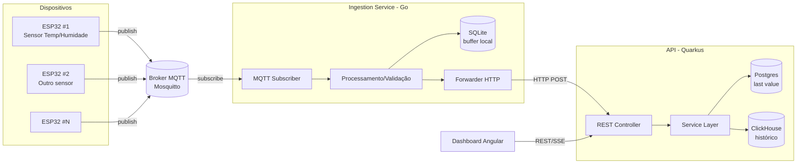

# Arquitetura Geral

## Objetivo do sistema
Vários dispositivos **ESP32**, cada um com um ou mais sensores (a começar por temperatura/humidade), publicam leituras via **MQTT**. Um **serviço de ingestão** subscreve o broker, valida/normaliza os dados, grava-os localmente em **SQLite** e encaminha-os para uma **API em Quarkus**, que persiste em **Postgres** (estado/últimos valores) e **ClickHouse** (histórico de série temporal) e serve um **dashboard**.

## Diagrama

## Responsabilidades por componente
| Componente | Responsabilidade | Não é responsável por |
|---|---|---|
| [[Esp32 - Firmware]] | Ler sensores, montar payload, publicar em MQTT | Persistência, lógica de negócio |
| [[Ingestion Service (Go)]] | Subscrever MQTT, validar/normalizar, buffer local (SQLite), encaminhar para a API | Servir o dashboard, guardar histórico definitivo |
| [[Api (Quarkus)]] | Receber leituras processadas, persistir (Postgres/ClickHouse), servir o dashboard | Falar diretamente com o MQTT/ESP32 |
| [[Platform (Dashboard Angular)]] | Consumir a API e apresentar dados (live + histórico) | Lógica de negócio, persistência |
| [[Deployment (Docker Compose)]] | Orquestrar broker, bases de dados e serviços localmente | Código de aplicação |

## Padrões de arquitetura por serviço

Cada serviço usa deliberadamente um padrão de arquitetura diferente — parte do objetivo de aprendizagem do projeto é praticar vários, não só um.

| Serviço | Padrão arquitetural | Como funciona (resumo) | Nota de detalhe |
|---|---|---|---|
| [[Esp32 - Firmware]] | Strategy / Dependency Inversion via interface | O núcleo agnóstico (Wi-Fi, scheduler, MQTT) depende só da interface `ISensor`; a implementação concreta do sensor é "injetada" no wiring (`main.c`) de cada dispositivo — o núcleo nunca muda. | [[Interfaces e Abstracao]] |
| [[Ingestion Service (Go)]] | Arquitetura Hexagonal (Ports & Adapters) | O núcleo (validação/processamento) define portas (`Subscriber`, `Storage`, `Forwarder`); adapters concretos (MQTT, SQLite, HTTP) implementam-nas e são substituíveis sem tocar no núcleo. | [[Ports and Adapters (Arquitetura Hexagonal)]] |
| [[Api (Quarkus)]] | Arquitetura em Camadas (Layered) + Repository Pattern | `Controller → Service → Repository` (interface), com uma implementação de `Repository` por base de dados (Postgres para o last value, ClickHouse para o histórico). | [[Arquitetura em Camadas (Layered Architecture)]] |
| [[Platform (Dashboard Angular)]] | Arquitetura de Componentes + Serviços (Angular) | Um serviço injetado concentra o acesso à API; os componentes só consomem e renderizam, sem lógica de rede própria. | [[Arquitetura de Componentes (Angular)]] |
| [[Deployment (Docker Compose)]] | Multi-container orquestrado (topologia de infraestrutura) | Cada responsabilidade (broker, bases de dados, serviços) corre no seu próprio container, ligados por uma rede interna do compose — não é um padrão de código, mas de implantação. | [[Deployment (Docker Compose)]] |

Todos os padrões partilham o mesmo princípio de fundo — ver [[Principios de Design]]: as dependências apontam sempre para uma interface/porta, nunca para uma implementação concreta.

## Porque esta separação?
Ver [[Principios de Design]] para a justificação (agnosticismo, ports & adapters) — é a base do objetivo de "skills de desenvolvimento de código" deste projeto: cada camada deve poder ser trocada (ex.: MQTT → Kafka, SQLite → outro buffer, Postgres → outra BD) sem reescrever as camadas vizinhas.

## Ver também
- [[Contrato de Dados]] — formato do payload/JSON entre as fronteiras.
- [[Roadmap]] — como esta arquitetura é construída incrementalmente.
