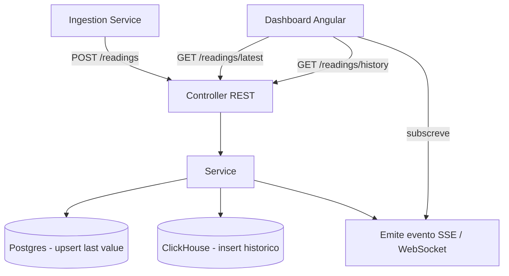

# Api (Quarkus)

Stack: Quarkus (Java). Pasta: `Api/` (atualmente scaffold Spring Boot — migração para Quarkus é uma task da [[Fase 4 - API Quarkus]]).

## Responsabilidade
Receber leituras processadas do [[Ingestion Service (Go)]], persistir o *last value* em Postgres e o histórico em ClickHouse, e servir o [[Platform (Dashboard Angular)]] (REST inicialmente, depois SSE/WebSocket).

## Porquê migrar de Spring Boot para Quarkus?
Decisão do projeto (objetivo de aprendizagem): Quarkus tem startup/footprint menor e um modelo de extensões diferente do Spring — bom contraste para quem já conhece Spring Boot. A migração em si é uma task de aprendizagem (Fase 4), não um code review do que já existe.

## Interfaces/contratos
- Recebe: `POST /readings` — ver [[Contrato de Dados]] §3.
- Expõe: `GET /readings/latest`, `GET /readings/latest/{deviceId}` (Fase 4); `GET /readings/history` (Fase 7); stream SSE/WebSocket (Fase 6).
- Persiste em: Postgres (`device_readings_latest`) e ClickHouse (`readings_history`) — ver [[Contrato de Dados]] §4-5 e [[Postgres vs ClickHouse]].

## Fluxo de um pedido



## Camadas propostas
```
Controller (REST) → Service → Repository (interface)
                                 ├── PostgresRepository
                                 └── ClickHouseRepository
```
O `Service` não sabe qual BD concreta está a usar — só fala com interfaces de repositório (mesmo princípio de [[Principios de Design]]).

## Tasks (ver também as fases correspondentes)
- [[Fase 4 - API Quarkus]] — scaffold Quarkus, `POST /readings`, Postgres.
- [[Fase 6 - Tempo Real (SSE-WebSocket)]] — push em tempo real.
- [[Fase 7 - ClickHouse e Historico]] — histórico + endpoint de série temporal.
- [[Fase 9 - Observabilidade e Resiliencia]] — métricas.

## Decisões em aberto
- [ ] ORM/acesso a dados: Panache (Hibernate) para Postgres vs JDBC puro para ClickHouse (o driver JDBC do ClickHouse não é "ORM-friendly").
- [ ] SSE vs WebSocket para tempo real.
- [ ] Autenticação entre Ingestion Service e API (mTLS? API key simples? nenhuma, por ser rede local?).

## Ver também
- [[Arquitetura Geral]], [[Estrategia de Testes]]
- [[Arquitetura em Camadas (Layered Architecture)]] (padrão usado neste serviço)
