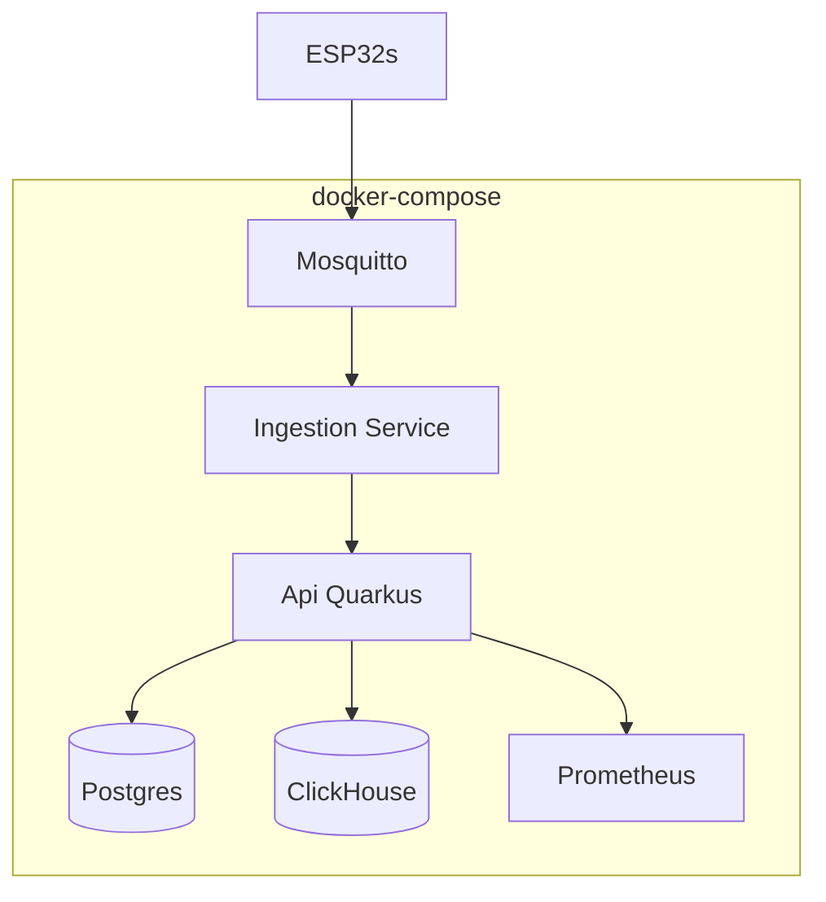

# Deployment (Docker Compose)

Pasta: `Deployment/Local/docker-compose.yaml` (atualmente vazio).

## Responsabilidade
Orquestrar a infraestrutura local: broker MQTT, Postgres, ClickHouse e (mais tarde) Prometheus/Grafana. SQLite **não** entra aqui — é um ficheiro local ao container/processo do [[Ingestion Service (Go)]].

## Fluxo (rede interna do compose)

## Serviços planeados por fase
| Serviço | Introduzido em |
|---|---|
| Mosquitto (MQTT) | [[Fase 3 - Broker MQTT e Ingestion Service]] |
| Postgres | [[Fase 4 - API Quarkus]] |
| ClickHouse | [[Fase 7 - ClickHouse e Historico]] |
| Prometheus | [[Fase 9 - Observabilidade e Resiliencia]] |
| Grafana | [[Fase 9 - Observabilidade e Resiliencia]] |

## Decisões em aberto
- [ ] Persistir volumes (Postgres/ClickHouse) em bind mounts locais para não perder dados entre `docker compose down`.
- [ ] Rede dedicada (`nasty-net`) para os serviços comunicarem por nome de serviço em vez de `localhost`.

## Ver também
- [[Arquitetura Geral]]
