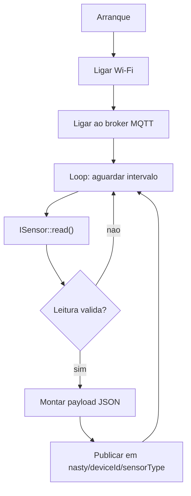

# Esp32 — Firmware

Stack: ESP-IDF (C/C++/CMake). Pasta: `Esp32/`.

## Responsabilidade
Ler sensor(es) local(is) e publicar leituras via MQTT. **Só** a implementação concreta do sensor muda entre dispositivos — tudo o resto (Wi-Fi, scheduler, cliente MQTT, montagem de payload) é partilhado.

## Fluxo (loop principal)

## Estrutura atual
- `components/sensors/ISensor.h` — interface `ISensor` (`init`, `start`, `read`) + struct `SensorData`. **Já existe**, é a base do agnosticismo do firmware.
- `components/sensors/temperature/` — `TempSensor : ISensor` (DHT), implementação por completar (ver [[Fase 2 - Sensor e MQTT no Firmware]]).
- `components/wifi/` — componente ainda vazio; vai acolher Wi-Fi + cliente MQTT.
- `main/main.c` — atualmente só um "Hello World"; vai acolher o wiring (`DeviceConfig` + `ISensor*` concreto + loop).

## Interfaces/contratos
- `ISensor` (ver código) — todo sensor novo implementa isto.
- Payload MQTT publicado — ver [[Contrato de Dados]].

## Atualizações de firmware
O ESP32 é atualizado remotamente via **OTA (Over-The-Air)**, sem precisar de ligação USB física — nota própria: [[Esp32 - OTA (Atualizacoes Over-The-Air)]].

## Tasks (ver também as fases correspondentes)
- [[Fase 1 - Nucleo Agnostico do Firmware]] — Wi-Fi, scheduler, wiring com `ISensor`.
- [[Fase 2 - Sensor e MQTT no Firmware]] — sensor real + publish MQTT.
- [[Fase 8 - Multiplos ESP32]] — provar reutilização com vários devices + introduzir OTA (ver [[Esp32 - OTA (Atualizacoes Over-The-Air)]]).

## Decisões em aberto
- [ ] Onde fica o `deviceId`: derivado do MAC address (`esp_read_mac`) vs configurado manualmente?
- [ ] Suportar múltiplos sensores no mesmo device (lista de `ISensor*`) desde já, ou só quando for preciso?
- [ ] Biblioteca MQTT: `esp-mqtt` (nativa do ESP-IDF) é a opção óbvia — confirmar.

## Ver também
- [[Arquitetura Geral]], [[Interfaces e Abstracao]]
- [[Esp32 - OTA (Atualizacoes Over-The-Air)]]
