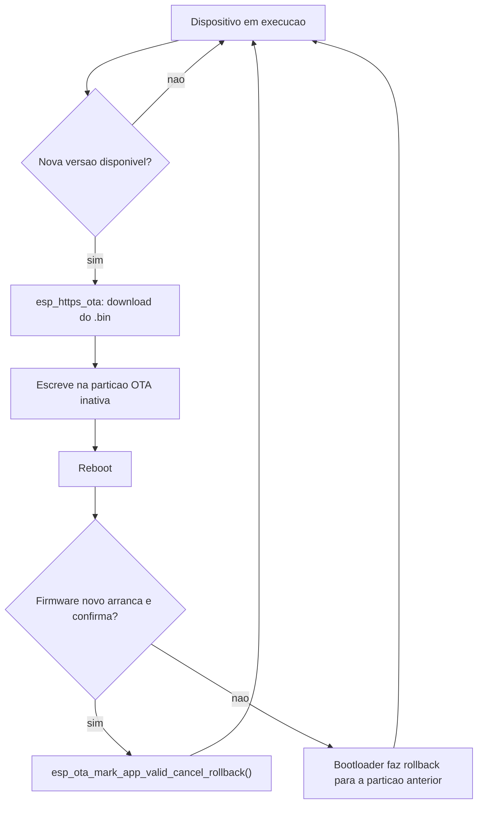

# Esp32 — OTA (Atualizações Over-The-Air)

Parte do firmware ([[Esp32 - Firmware]]), mas com página própria dado o peso próprio do mecanismo (partições, segurança, rollback).

## Responsabilidade
Permitir atualizar o firmware de cada ESP32 remotamente — sem ligação USB física — descarregando um binário novo por HTTPS.

## Porquê
- Vários dispositivos espalhados (ver [[Fase 8 - Multiplos ESP32]]) — reflashar cada um fisicamente não escala.
- Ainda mais relevante se um sensor ficar instalado num sítio de acesso físico incómodo (fora de casa, num sítio alto, etc.).

## Como funciona (ESP-IDF)
- O ESP-IDF usa duas partições de app (`ota_0`, `ota_1`), além da `factory`/bootloader; a cada atualização, o binário novo é escrito na partição inativa e o bootloader passa a arrancar a partir dessa.
- Duas formas de implementar: API nativa (`app_update`) ou a API simplificada **`esp_https_ota`** (download + escrita da partição num único fluxo, sobre HTTPS) — a segunda é a recomendada para começar.
- Mecanismo de **rollback**: se o firmware novo não confirmar "boot válido" (`esp_ota_mark_app_valid_cancel_rollback`), o bootloader volta à partição anterior no reboot seguinte — proteção contra um firmware que não arranca.

### Fluxo de atualização

## Tasks
- [ ] Definir o particionamento (`partitions.csv`) com `factory` + `ota_0` + `ota_1` (ou só duas OTA slots, sem `factory`).
- [ ] Implementar o cliente `esp_https_ota` no firmware, apontando para um endpoint HTTPS que serve o `.bin` mais recente.
- [ ] Decidir onde vive esse endpoint: no VPS que já serve o dashboard/API (ver [[Deploy em Producao - Visao Geral]]), ou um bucket/storage estático separado.
- [ ] Versionamento do firmware (ex. incluir a versão atual no payload MQTT, ou um endpoint `/version` que o ESP32 consulta antes de decidir atualizar).
- [ ] Implementar e validar o rollback (`esp_ota_mark_app_valid_cancel_rollback`) — testar de propósito um firmware que falha, confirmar que o dispositivo volta ao anterior sozinho.
- [ ] Decidir o gatilho da atualização: polling periódico a um endpoint de versão, ou um comando via MQTT (ex. `nasty/<deviceId>/ota` → dispara a atualização).

## Decisões em aberto
- [ ] Assinatura/verificação do binário (`CONFIG_SECURE_SIGNED_APPS`) — vale a pena num projeto de aprendizagem, ou fica para depois?
- [ ] Atualizar todos os dispositivos ao mesmo tempo vs faseado ("canary" — um device primeiro, confirmar que corre bem, só depois os restantes).
- [ ] Servir o `.bin` via HTTPS público (rota A) vs só através da VPN (rota B) — ver [[Deploy em Producao - Visao Geral]].

## Quando entra no roadmap
Ver [[Fase 8 - Multiplos ESP32]] — é onde faz mais sentido introduzir OTA, quando já há mais do que um dispositivo real a gerir e o acesso físico deixa de ser prático.

## Ver também
- [[Esp32 - Firmware]]
- [[Fase 8 - Multiplos ESP32]]
- [[07 - Recursos de Aprendizagem]]
