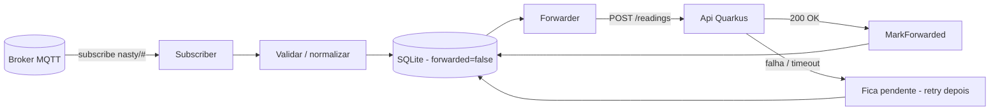

# Ingestion Service (Go)

Stack: Go. Pasta planeada: `Ingestion/` (ainda por criar — ver [[Fase 0 - Baseline do Scaffold]]).

## Responsabilidade
Ponte entre o mundo MQTT (não fiável, fire-and-forget) e a API (que pode estar em baixo): subscreve o broker, valida/normaliza as leituras, grava-as num buffer local (SQLite) e encaminha-as para a [[Api (Quarkus)]], com retry se a API estiver indisponível.

## Porque um serviço à parte (e não a API a subscrever MQTT diretamente)?
Separa a preocupação "ingestão contínua e resiliente de um transporte pub/sub" da preocupação "servir um dashboard e guardar histórico definitivo". Também permite treinar [[Ports and Adapters (Arquitetura Hexagonal)]] num serviço pequeno e focado.

## Fluxo



## Design proposto (interfaces internas)
```go
type Subscriber interface {
    Subscribe(topic string, handler func(Reading)) error
}

type Storage interface {
    Save(Reading) error
    PendingToForward() ([]Reading, error)
    MarkForwarded(id int64) error
}

type Forwarder interface {
    Forward(Reading) error
}
```
- `Subscriber`: implementação MQTT (Fase 3); podia ser trocada por Kafka sem tocar no resto.
- `Storage`: implementação SQLite (Fase 3).
- `Forwarder`: implementação HTTP para a API Quarkus (Fase 4).

## Interfaces/contratos externos
- Consome: payload MQTT — ver [[Contrato de Dados]] §1.
- Escreve: tabela `readings` em SQLite — ver [[Contrato de Dados]] §2.
- Produz: `POST` para a API — ver [[Contrato de Dados]] §3.

## Tasks (ver também as fases correspondentes)
- [[Fase 3 - Broker MQTT e Ingestion Service]] — subscriber + storage.
- [[Fase 4 - API Quarkus]] — forwarder + retry.
- [[Fase 9 - Observabilidade e Resiliencia]] — métricas + teste de resiliência.

## Decisões em aberto
- [ ] Framework MQTT em Go: `eclipse/paho.mqtt.golang` é a opção padrão.
- [ ] Driver SQLite: `mattn/go-sqlite3` (cgo) vs `modernc.org/sqlite` (puro Go, mais fácil de cross-compile).
- [ ] Forward síncrono (por mensagem) vs em batch (a cada N segundos)?

## Ver também
- [[Arquitetura Geral]], [[SQLite como Buffer Local]], [[MQTT - Conceitos]]
