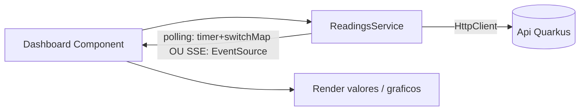

# Platform (Dashboard Angular)

Stack: Angular. Pasta: `Platform/` (ainda vazia — scaffold é task da [[Fase 5 - Dashboard Angular Polling]]).

## Responsabilidade
Apresentar os dados servidos pela [[Api (Quarkus)]]: valores atuais por device/sensor e, mais tarde, histórico em gráficos.

## Interfaces/contratos
- Consome a API via um `service` Angular dedicado (nunca chamadas HTTP espalhadas pelos componentes).
- URL da API via `environment.ts` (nunca hardcoded).

## Fluxo

## Tasks (ver também as fases correspondentes)
- [[Fase 5 - Dashboard Angular Polling]] — scaffold + polling.
- [[Fase 6 - Tempo Real (SSE-WebSocket)]] — substituir polling.
- [[Fase 7 - ClickHouse e Historico]] — gráficos de série temporal.
- [[Fase 8 - Multiplos ESP32]] — listar/filtrar por device.

## Decisões em aberto
- [ ] Biblioteca de gráficos (ex.: ngx-charts, Chart.js, ECharts) — escolher na Fase 7.
- [ ] Gestão de estado: signals nativos do Angular vs um store dedicado (RxJS puro é provavelmente suficiente para o tamanho do projeto).

## Ver também
- [[Arquitetura Geral]]
- [[Arquitetura de Componentes (Angular)]] (padrão usado neste serviço)
