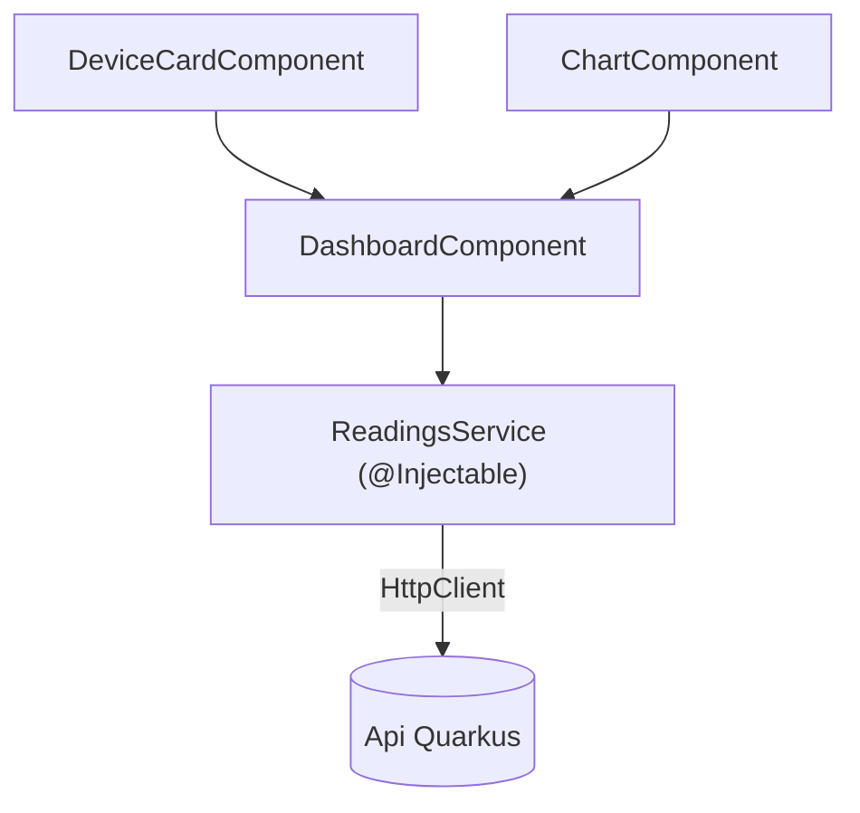

# Arquitetura de Componentes (Angular)

## Ideia central
O Angular organiza a UI numa árvore de **componentes** (cada um com o seu template, estilos e lógica própria) e isola o acesso a dados/lógica partilhada em **serviços** injetados via Dependency Injection. Os dados fluem de forma previsível: o serviço obtém/guarda o estado, o componente só o consome e reage a mudanças.

## Estrutura aplicada à [[Platform (Dashboard Angular)]]

- **Serviço** (`ReadingsService`) — único ponto de acesso à API; nunca chamadas HTTP espalhadas pelos componentes.
- **Componentes** — recebem dados via `@Input()` ou subscrevem observables do serviço; disparam ações via `@Output()`. Componentes "burros" (ex. `DeviceCardComponent`) só recebem e mostram dados; o `DashboardComponent` orquestra.
- **Dependency Injection** — o serviço é injetado no construtor/`inject()` do componente; facilita substituir por um mock nos testes (a mesma ideia de [[Interfaces e Abstracao]], aqui aplicada à classe injetável em vez de a uma interface explícita).

## Neste projeto
Ver a aplicação em [[Platform (Dashboard Angular)]], [[Fase 5 - Dashboard Angular Polling]] e [[Fase 6 - Tempo Real (SSE-WebSocket)]].

## Ver também
- [[Interfaces e Abstracao]]
- [[Estrategia de Testes]]
