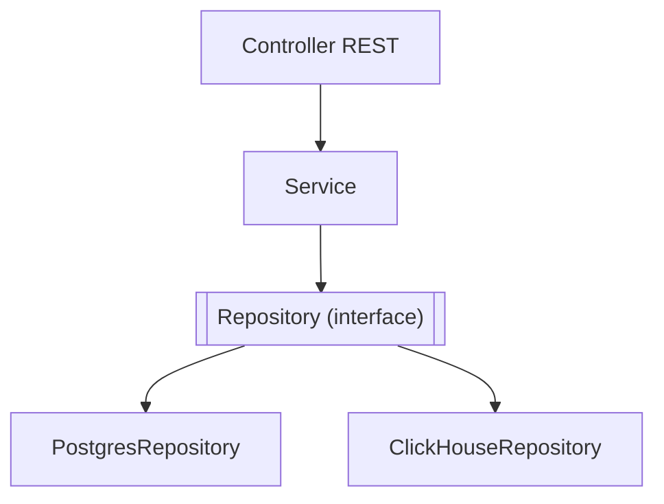

# Arquitetura em Camadas (Layered Architecture)

## Ideia central
Organiza o código em camadas horizontais, em que cada camada só pode depender da camada imediatamente abaixo (nunca ao contrário, nem saltando camadas): Apresentação → Serviço/Aplicação → Dados. Cada camada tem uma única responsabilidade e é substituível sem afetar as restantes, desde que a interface entre elas se mantenha.

## Camadas aplicadas à [[Api (Quarkus)]]

- **Controller** — só trata de HTTP (parsing do pedido, validação de entrada, serialização da resposta). Sem lógica de negócio.
- **Service** — orquestra a lógica/casos de uso; não sabe qual motor de base de dados concreto está a usar.
- **Repository** — interface de acesso a dados; cada implementação fala com um motor de persistência diferente (Postgres para o *last value*, ClickHouse para o histórico).

## Diferença para Ports & Adapters
Layered é mais simples e linear (uma cadeia de cima para baixo); [[Ports and Adapters (Arquitetura Hexagonal)]] generaliza a mesma ideia para qualquer direção (entrada e saída), não só "de cima para baixo". Na prática, o Repository Pattern usado aqui já é uma forma simplificada de porta/adapter aplicada só à camada de dados.

## Neste projeto
Ver a aplicação em [[Api (Quarkus)]] (secção "Camadas propostas") e [[Fase 4 - API Quarkus]].

## Ver também
- [[Ports and Adapters (Arquitetura Hexagonal)]]
- [[Interfaces e Abstracao]]
