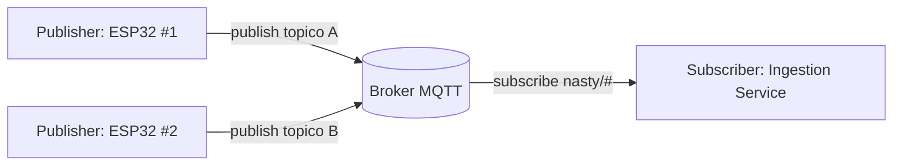

# MQTT — Conceitos

## O essencial
- Protocolo pub/sub leve, pensado para dispositivos com pouca energia/largura de banda (perfeito para ESP32).
- **Broker** central (aqui: Mosquitto) — publishers e subscribers nunca falam diretamente entre si.
- **Tópicos** hierárquicos, separados por `/` (ex.: `nasty/esp32-01/temperature`). Suportam wildcards na subscrição: `+` (um nível), `#` (todos os níveis restantes).
- **QoS** (Quality of Service):
  - 0 — no máximo uma vez (fire and forget).
  - 1 — pelo menos uma vez (pode duplicar).
  - 2 — exatamente uma vez (mais caro).
  - Para leituras periódicas de sensores, QoS 0 ou 1 costuma ser suficiente — perder uma leitura ocasional não é crítico.
- **Retained messages** — o broker guarda a última mensagem de um tópico e entrega-a imediatamente a quem subscrever depois. Útil para "último valor conhecido" sem esperar pela próxima leitura.
- **LWT (Last Will and Testament)** — mensagem que o broker publica automaticamente se um cliente desligar inesperadamente (útil para saber se um ESP32 caiu).

## Fluxo pub/sub



## Neste projeto
- Ver o tópico e payload propostos em [[Contrato de Dados]] §1.
- O [[Ingestion Service (Go)]] subscreve `nasty/#` (wildcard multi-nível).

## Ferramentas úteis para debug
```bash
mosquitto_sub -h localhost -t 'nasty/#' -v
mosquitto_pub -h localhost -t 'nasty/esp32-01/temperature' -m '{"value":23.4}'
```

## Ver também
- [[Esp32 - Firmware]], [[Ingestion Service (Go)]]
