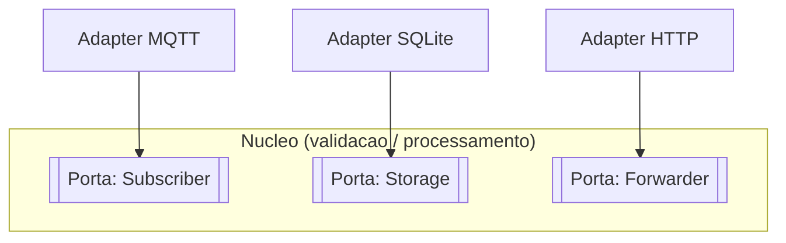

# Ports and Adapters (Arquitetura Hexagonal)

## Ideia central
O "núcleo" de um serviço (a lógica de negócio) define **portas** (interfaces) para tudo o que precisa do mundo exterior — entrada (ex.: receber uma leitura) e saída (ex.: gravar, encaminhar). **Adaptadores** concretos implementam essas portas para uma tecnologia específica (MQTT, SQLite, HTTP...).

## Aplicação direta neste projeto: [[Ingestion Service (Go)]]
- Porta `Subscriber` → adapter MQTT (Fase 3). Trocar para Kafka no futuro = só um adapter novo.
- Porta `Storage` → adapter SQLite (Fase 3). Trocar para Postgres embutido = só um adapter novo.
- Porta `Forwarder` → adapter HTTP para a [[Api (Quarkus)]] (Fase 4).

## Aplicação na [[Api (Quarkus)]]
- Porta `Repository` → adapters `PostgresRepository` e `ClickHouseRepository`.

## Benefício prático (e porque interessa para este projeto)
Cada adapter é testável isoladamente e o núcleo é testável **sem** nenhuma dependência externa (broker, BD, rede) — ver [[Estrategia de Testes]].

## Ver também
- [[Interfaces e Abstracao]]
- [[Principios de Design]]
