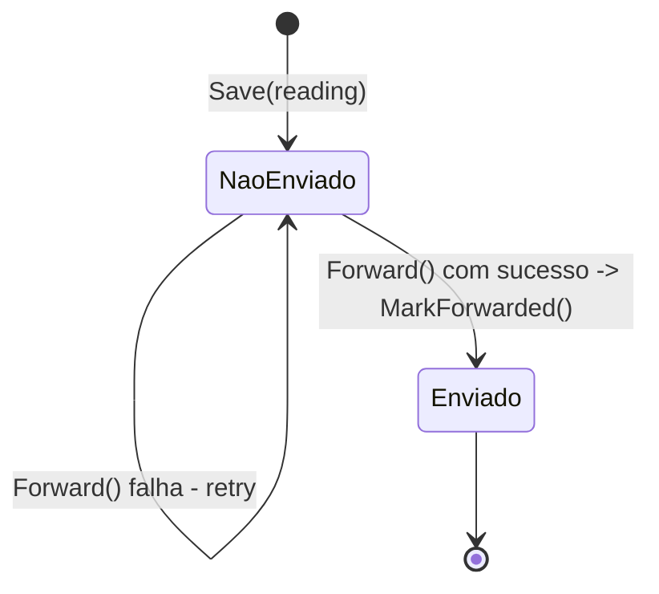

# SQLite como Buffer Local

## Porque SQLite aqui e não direto para a API?
O [[Ingestion Service (Go)]] recebe mensagens MQTT de forma contínua, mas a [[Api (Quarkus)]] pode estar temporariamente indisponível (deploy, crash, rede). Gravar sempre primeiro em SQLite local garante:
- **Durabilidade** — nada se perde enquanto a API estiver em baixo.
- **Desacoplamento temporal** — o ritmo de chegada de MQTT não precisa de ser igual ao ritmo de envio à API.
- **Retry simples** — basta uma coluna `forwarded` (ver [[Contrato de Dados]] §2) para saber o que ainda falta encaminhar.

## Porque SQLite (e não Postgres local, Redis, etc.)?
- Zero infraestrutura extra — é um ficheiro, ideal para um serviço pequeno e single-node como o Ingestion.
- Suficiente para o volume esperado (sensores a publicar a cada segundos/minutos, não milhares de msgs/segundo).
- Se um dia o Ingestion precisar de escalar horizontalmente, este é o primeiro componente a repensar (SQLite não é multi-writer distribuído).

## Padrão de uso
1. `Save(reading)` — grava com `forwarded = false`.
2. Um processo periódico (ou o próprio handler) chama `PendingToForward()`.
3. Ao confirmar sucesso no `Forwarder`, chama `MarkForwarded(id)`.

## Ver também
- [[Ingestion Service (Go)]], [[Fase 3 - Broker MQTT e Ingestion Service]], [[Fase 9 - Observabilidade e Resiliencia]]
