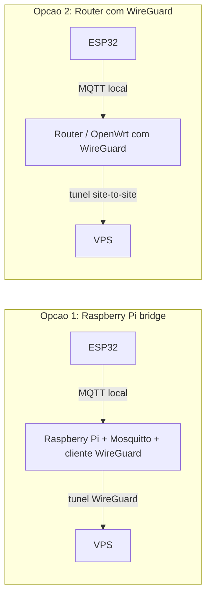

# Alternativa: VPN Privada com WireGuard

Rota B — ver [[Deploy em Producao - Visao Geral]]. Em vez de expor o dashboard/API/MQTT publicamente com domínio + TLS, monta-se uma VPN privada e só quem está ligado a ela consegue aceder — sem domínio, sem certificados públicos, superfície de ataque muito menor (só uma porta UDP exposta).

> Conceitos (o que é uma VPN, porquê WireGuard, chaves/peers, topologias hub-and-spoke vs site-to-site): ver [[VPN e WireGuard]] em `06 - Conceitos de Infraestrutura/`.

## Aplicação neste projeto
Dentro da VPN, o dashboard e a API ficam acessíveis pelo IP privado do host (ex. `http://10.10.0.1:8080`), sem NGINX nem TLS a ser estritamente necessários (a VPN já cifra tudo).

## Tasks
- [ ] Instalar WireGuard no host (VPS ou doméstico).
- [ ] Gerar par de chaves do servidor; configurar interface `wg0` (`10.10.0.1/24`, porta UDP `51820`).
- [ ] Abrir só essa porta UDP no firewall (ver [[02 - VPS e Hardening]]) — nada de HTTP/HTTPS público nesta rota.
- [ ] Por cada dispositivo cliente (portátil, telemóvel): gerar par de chaves, adicionar como peer no servidor, distribuir o ficheiro de configuração (ou QR code, para telemóvel).
- [ ] Confirmar que o dashboard/API ficam acessíveis pelo IP da VPN a partir de um cliente ligado, e **não** acessíveis do resto da internet.

## E o ESP32?
O suporte a WireGuard em ESP-IDF é limitado/experimental (não é uma biblioteca de primeira classe como o Wi-Fi/MQTT). Duas alternativas realistas:
1. **O ESP32 fica na rede local de casa**, publica para um Mosquitto que corre também localmente (ex. num Raspberry Pi), e é esse Raspberry Pi que tem um cliente WireGuard e faz de ponte para o VPS — o ESP32 nunca sai da rede local.
2. **Um gateway/roteador com suporte a WireGuard** (muitos routers domésticos e OpenWrt suportam nativamente) cria um túnel site-to-site entre a rede de casa e o VPS — o ESP32 nem sabe que a VPN existe, fala MQTT normalmente dentro da rede local, e é o roteador que encaminha até ao VPS.

A opção 2 é a mais transparente: nada muda no firmware do ESP32 (continua a publicar para um IP/hostname local), só a infraestrutura de rede é que faz o encaminhamento seguro até ao VPS.

## Prós / Contras face à rota A (domínio público)
| | VPN (WireGuard) | Domínio público + NGINX |
|---|---|---|
| Custo | Sem domínio nem certificados | Domínio + (TLS é grátis via Let's Encrypt) |
| Superfície de ataque | Mínima (1 porta UDP) | Maior (80/443 abertos ao mundo) |
| Acesso | Só quem tem o cliente WireGuard instalado | Qualquer pessoa com o link |
| Complexidade inicial | Configurar peers por dispositivo | Configurar DNS + certificados + server blocks |

## Decisões em aberto
- [ ] Servidor WireGuard no mesmo VPS da aplicação vs numa máquina dedicada só para VPN.
- [ ] ESP32: via Raspberry Pi bridge (opção 1) ou via router com WireGuard (opção 2) — depende do hardware de rede disponível em casa.
- [ ] Combinar as duas rotas: dashboard acessível só via VPN, mas manter um subdomínio público só para o webhook/endpoint que o ESP32 usa (se algum dia o ESP32 estiver fora da rede de casa) — avaliar se compensa a complexidade extra.

## Ver também
- [[02 - VPS e Hardening]]
- [[04 - Deploy da Aplicacao]]
- [[MQTT - Conceitos]]
- [[VPN e WireGuard]] (conceito)
