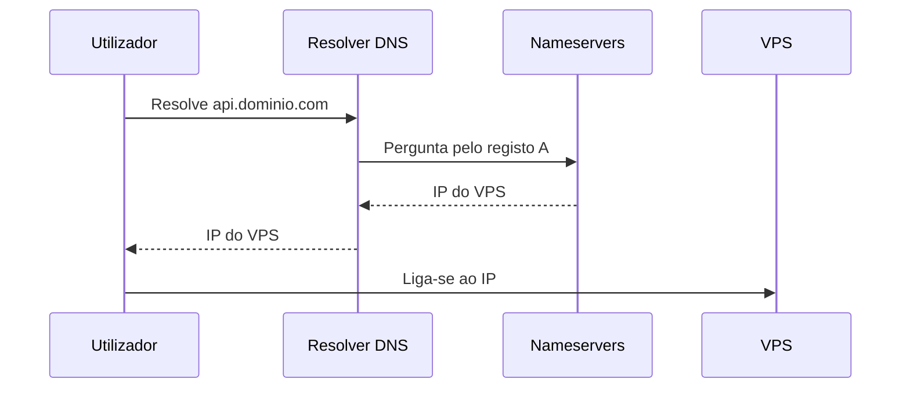

# Domínio e DNS

## O essencial
- Um **domínio** (ex. `nasty-plattform.dev`) é só um nome legível que se compra num **registrar** (Namecheap, Cloudflare Registrar, ...) por um período (normalmente 1 ano, renovável).
- O **DNS** traduz esse nome num IP. Quem responde a essas traduções é o **DNS provider** (pode ser o próprio registrar, ou outro serviço, ex. Cloudflare DNS — grátis, e independente de onde o domínio foi comprado).
- Para um domínio "apontar" para um DNS provider diferente do registrar, mudam-se os **nameservers** do domínio nas definições do registrar.

## Fluxo de resolução

## Tipos de registo mais usados neste projeto
| Registo | Serve para |
|---|---|
| `A` | Nome → endereço IPv4 (ex. `api.dominio.com → 203.0.113.10`) |
| `AAAA` | Nome → endereço IPv6 |
| `CNAME` | Nome → outro nome (alias) |
| `TXT` | Texto livre — usado por validações (ex. ACME/Let's Encrypt, verificação de propriedade) |

## TTL e propagação
- **TTL** (Time To Live) diz quanto tempo os resolvers DNS podem guardar em cache uma resposta antes de perguntar outra vez. Baixo (ex. 300s) enquanto se testa, mais alto depois de estável.
- Uma mudança de registo pode demorar minutos a algumas horas a propagar globalmente, mesmo com TTL baixo — depende de caches intermédias.

## Proxy vs DNS-only (Cloudflare e similares)
Alguns DNS providers oferecem um modo "proxy" (o tráfego passa primeiro pela rede deles, escondendo o IP real e filtrando alguns ataques). Este modo normalmente só entende HTTP/HTTPS — para portas TCP arbitrárias (como MQTT), é preciso desativar o proxy nesse registo específico ("DNS only").

## Neste projeto
Ver a aplicação prática em [[01 - Dominio e DNS]].

## Ver também
- [[Reverse Proxy e NGINX]]
- [[Deploy em Producao - Visao Geral]]
