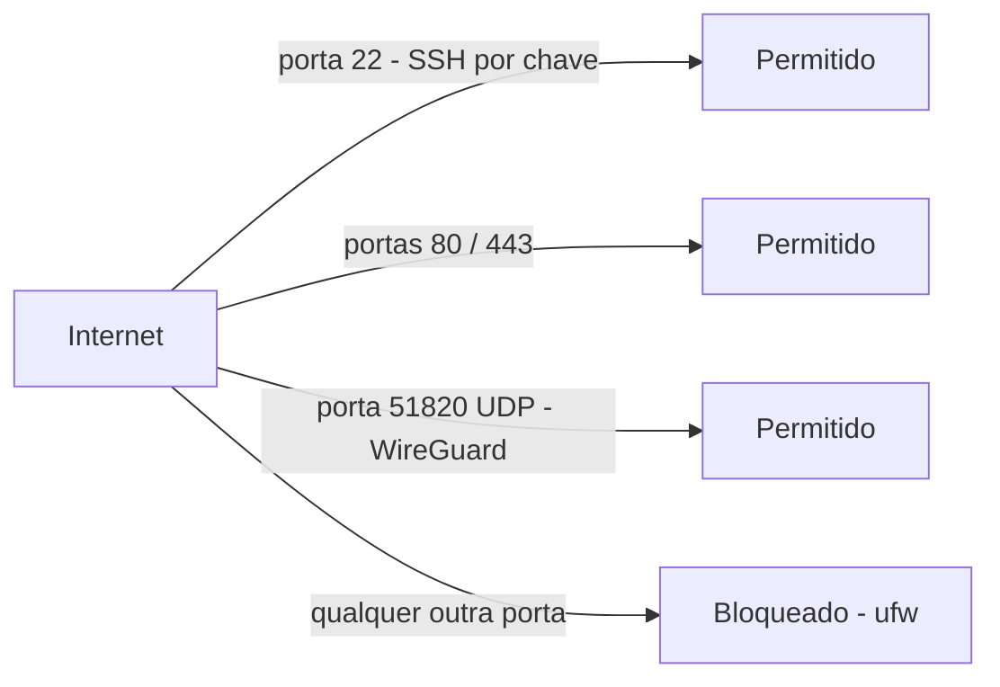

# Firewall e Hardening Básico

## Ideia central
Um servidor exposto à internet é atacado por bots automaticamente, minutos depois de ligar — não é preciso ser "alvo" de ninguém. Hardening básico é o conjunto mínimo de medidas para reduzir essa superfície de ataque antes de pôr qualquer aplicação a correr.

## Camadas
- **Firewall** (`ufw` no Ubuntu/Debian) — política por omissão "negar tudo", com exceções explícitas só para as portas realmente necessárias (SSH, HTTP/HTTPS, ou a porta UDP da VPN — ver [[VPN e WireGuard]]).
- **SSH por chave pública** — a password é sempre o alvo mais fácil de um brute-force; desativar `PasswordAuthentication` remove essa via de ataque por completo.
- **`fail2ban`** — bane automaticamente IPs que falham autenticação repetidamente (SSH, e outros serviços expostos).
- **Atualizações automáticas de segurança** — pacotes do SO com CVEs conhecidas são o vetor mais comum de comprometimento; `unattended-upgrades` (Ubuntu/Debian) aplica patches de segurança sem intervenção manual.
- **Princípio do menor privilégio** — nunca correr a aplicação como `root`; um utilizador dedicado com `sudo` para administração, containers a correr com utilizadores não-root sempre que possível.

## Fluxo (o que passa, o que é bloqueado)

## Regra prática para este projeto
Só o essencial fica exposto ao exterior: SSH (22), HTTP/HTTPS (80/443) se fores pela rota de domínio público, e/ou a porta UDP do WireGuard se fores pela rota VPN. Todos os serviços internos (Postgres, ClickHouse, Mosquitto sem TLS) ficam só na rede interna do `docker compose`, nunca com porta publicada para o host.

## Neste projeto
Ver a aplicação prática em [[02 - VPS e Hardening]].

## Ver também
- [[VPS e Cloud]]
- [[VPN e WireGuard]]
