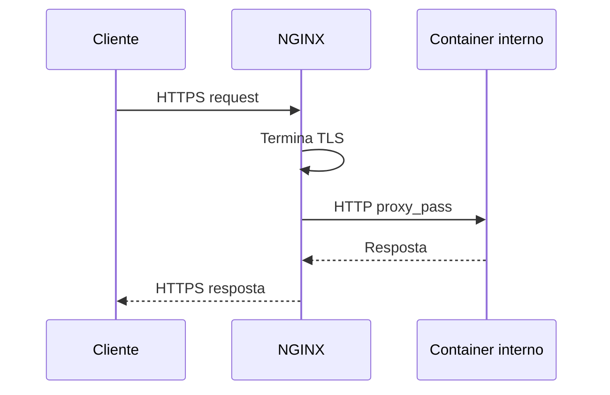

# Reverse Proxy e NGINX

## O que é um reverse proxy
Um proxy normal representa o **cliente** perante a internet (ex. um proxy corporativo). Um **reverse proxy** representa o **servidor**: fica à frente de vários serviços internos e é o único ponto que o exterior contacta diretamente. Os clientes nunca sabem quantos serviços/containers existem por trás.

## Porque se usa um reverse proxy aqui
- **Único entrypoint**: só uma porta 80/443 exposta, em vez de cada serviço (Api, dashboard) ter a sua própria porta pública.
- **Terminação TLS**: o certificado HTTPS vive só no reverse proxy; os serviços internos falam HTTP simples entre si, na rede privada do `docker compose` — simplifica muito a gestão de certificados (ver [[TLS e Certificados (Lets Encrypt)]]).
- **Roteamento por hostname/path**: `dashboard.dominio.com` e `api.dominio.com` podem apontar para o mesmo IP e o NGINX decide, pelo cabeçalho `Host`, para qual container reencaminhar.
- **Ponto único para regras transversais**: rate limiting, headers de segurança, logs de acesso, redirecionamento HTTP→HTTPS.

## Fluxo de um pedido

## HTTP vs TCP puro (relevante para MQTT)
O NGINX, na configuração normal (`location`/`proxy_pass` dentro de um bloco `server { listen 80/443; }`), só entende HTTP/HTTPS. Para encaminhar um protocolo TCP arbitrário como o MQTT (porta 1883/8883), é preciso o módulo **`stream`**, configurado a um nível diferente do ficheiro (`stream { ... }`, fora dos blocos `http {}`) — é um proxy TCP "cego" ao conteúdo, sem noção de hostname HTTP.

## Neste projeto
Ver a aplicação prática (server blocks, certbot, decisão sobre expor MQTT) em [[03 - NGINX Reverse Proxy]].

## Ver também
- [[TLS e Certificados (Lets Encrypt)]]
- [[Dominio e DNS]]
