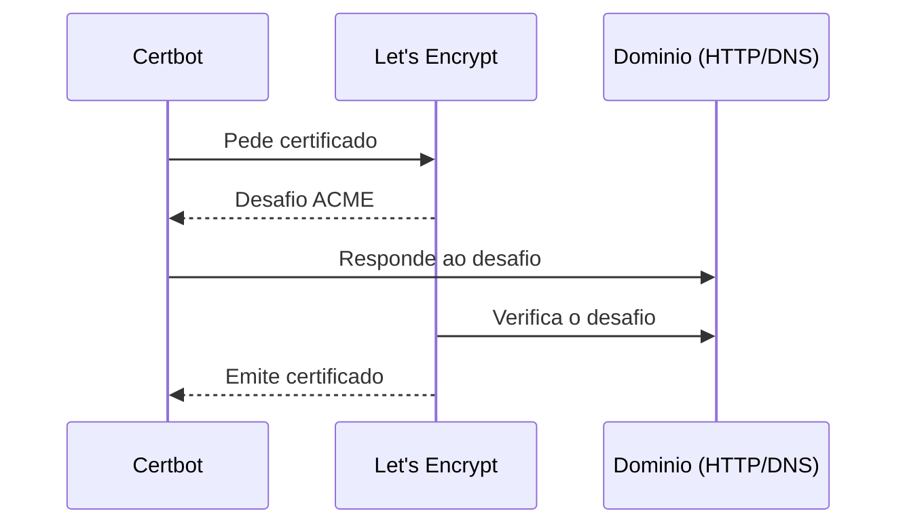

# TLS e Certificados (Let's Encrypt)

## O essencial
- **TLS** cifra a ligação entre cliente e servidor e prova a identidade do servidor (é mesmo `api.dominio.com` e não um impostor).
- Um **certificado** é emitido por uma **CA** (Certificate Authority) e assina a chave pública do servidor, atestando que pertence àquele domínio.
- **Let's Encrypt** é uma CA gratuita e automatizada — em vez de um processo manual de validação, usa o protocolo **ACME**: prova-se que controlas o domínio (respondendo a um desafio HTTP num caminho específico, ou criando um registo `TXT` no DNS) e o certificado é emitido/renovado automaticamente.

## Fluxo ACME (emissão do certificado)

## Ferramentas
- **Certbot** — cliente ACME mais comum; consegue configurar o NGINX diretamente (`certbot --nginx`) ou só emitir o certificado e deixar a configuração manual.
- **`acme-companion`** (com `nginx-proxy`) — automatiza tudo via labels do Docker, útil quando toda a stack já corre em `docker compose`.
- Certificados Let's Encrypt duram 90 dias — a renovação **tem de ser automática** (cron/systemd timer), nunca manual.

## Neste projeto
Ver a aplicação prática em [[03 - NGINX Reverse Proxy]].

## Ver também
- [[Reverse Proxy e NGINX]]
- [[Dominio e DNS]]
