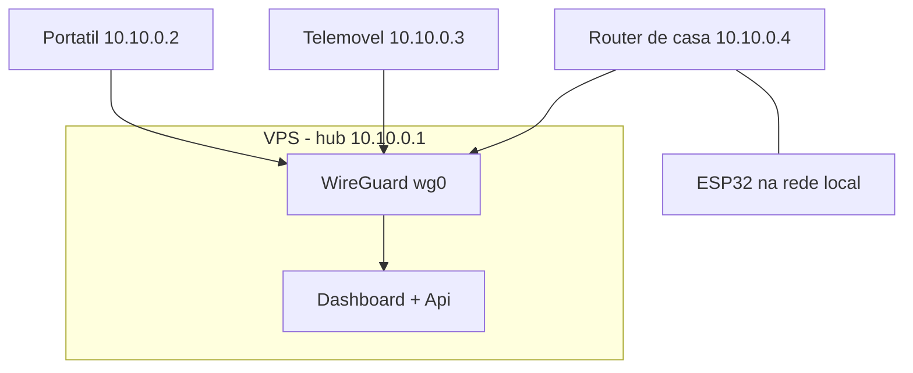

# VPN e WireGuard

## O que é uma VPN
Uma **VPN** (Virtual Private Network) cria uma rede privada virtual sobre a internet: dispositivos em locais físicos diferentes passam a comportar-se como se estivessem na mesma rede local, com tráfego cifrado entre eles. Serviços podem ficar acessíveis só a quem está "dentro" dessa rede, sem nunca serem expostos à internet pública.

## Porque WireGuard (e não OpenVPN/IPSec)
- **Simplicidade**: configuração é um ficheiro de poucas linhas por peer, baseado em pares de chaves (privada/pública) — sem PKI, sem certificados, sem CA a gerir.
- **Performance**: corre no kernel (em Linux), overhead muito menor que soluções mais antigas em userspace.
- **Superfície de ataque pequena**: uma única porta UDP exposta; se o pacote não tiver a chave certa, é simplesmente ignorado (não há resposta nenhuma a um scan não autorizado — ao contrário de TCP, que responde `RST` ou `SYN-ACK`).

## Conceitos-chave
- **Par de chaves** (privada/pública) por peer — como SSH, não como TLS/certificados.
- **Interface virtual** (`wg0`) — cada peer (servidor e clientes) tem um IP dentro da sub-rede privada da VPN (ex. `10.10.0.0/24`).
- **`AllowedIPs`** — define, por peer, que tráfego passa pelo túnel (pode ser só o IP do próprio peer, ou uma rede inteira, no caso de um peer fazer de gateway/bridge para outra rede — relevante para o caso do ESP32, ver [[06 - Alternativa VPN WireGuard]]).

## Topologia usada neste projeto (hub-and-spoke)

## Topologias
- **Hub-and-spoke** (a mais simples e a usada neste projeto): o VPS é o "hub", todos os clientes ligam-se a ele; clientes não se veem diretamente entre si, só através do hub.
- **Site-to-site**: dois routers/gateways ligam duas redes inteiras (ex. a rede de casa e o VPS) — útil quando um dispositivo (como o ESP32) não pode correr WireGuard ele próprio, mas o router da rede onde está, sim.

## Neste projeto
Ver a aplicação prática (setup do servidor, peers, e as opções para o ESP32) em [[06 - Alternativa VPN WireGuard]].

## Ver também
- [[Firewall e Hardening Basico]]
- [[MQTT - Conceitos]]
